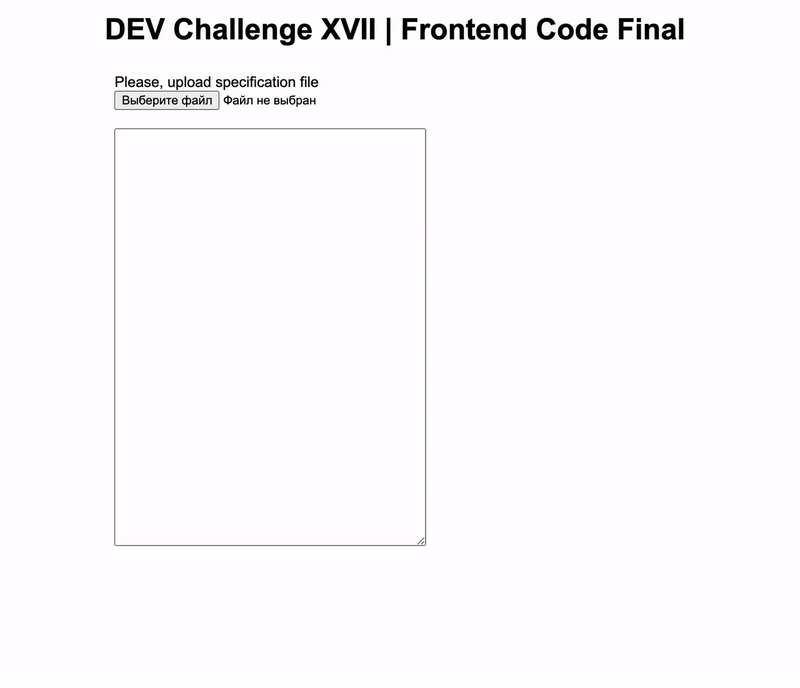

# DEV Challenge XVII | Frontend Code Final
Objective: to develop a service that allows you to build a model of the room according to the specification, calculate the free space and display it in the 2D-projection. [Full task](/task.pdf)

